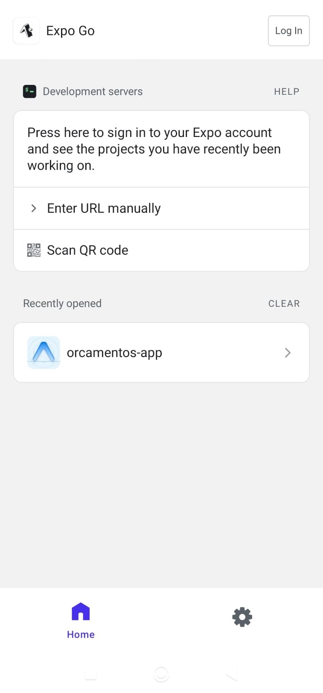
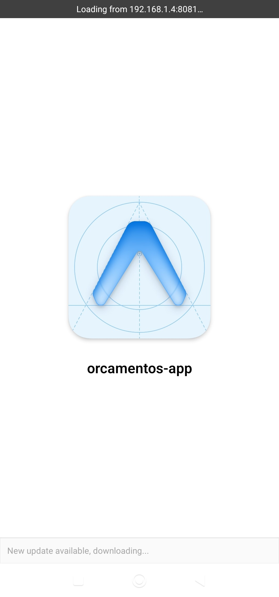
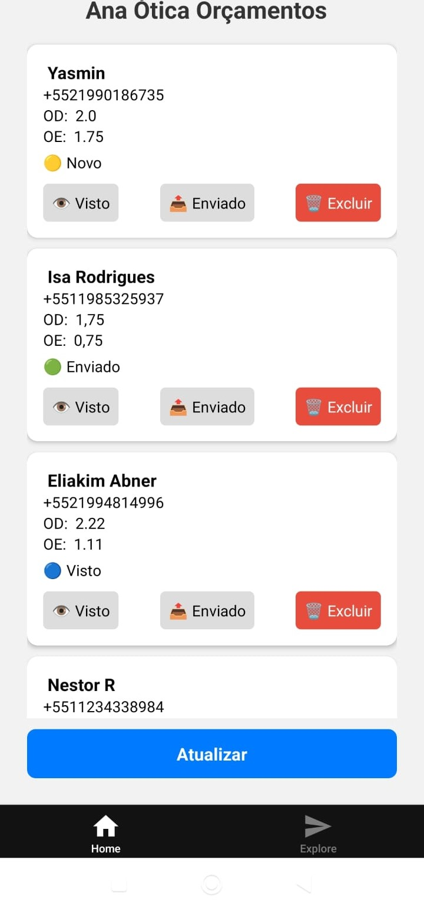
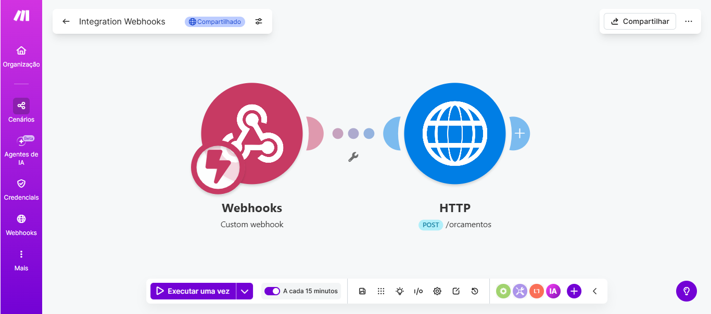
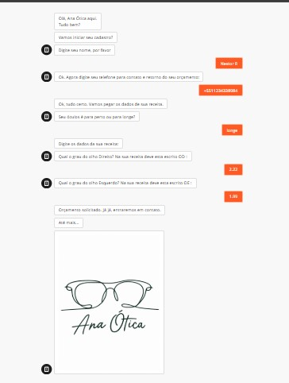

# app-orcamentos-api
Sistema completo para recebimento e gerenciamento de orçamentos.  

# 📱 Sistema de Controle de Orçamentos

## 🧭 Visão Geral

Este projeto é um sistema completo para **recebimento e gerenciamento de orçamentos**, integrando automação, backend e aplicativo mobile.

O fluxo permite que dados enviados por um formulário sejam automaticamente processados e exibidos em um app para controle.

---

## 🧱 Arquitetura do Sistema


Typebot → Make (Webhook) → API (Spring Boot) → App Mobile (React Native)


---

## 🔗 Repositórios

### 🔹 Backend (API)

Responsável por processar e armazenar os dados.

👉 https://github.com/eliakim-abner/app-orcamentos-api

**Tecnologias:**

* Java
* Spring Boot

---

### 🔹 App Mobile

Responsável pela interface e interação do usuário.

👉 https://github.com/eliakim-abner/app-orcamentos-mobile

**Tecnologias:**

* React Native (Expo)
* TypeScript

---

## ⚙️ Funcionalidades

* 📥 Recebimento automático de orçamentos
* 📋 Listagem no app
* 👁 Marcar como visto
* 📤 Marcar como enviado
* 🗑 Excluir orçamento
* 🔄 Atualização manual dos dados

---

## 🌐 API Endpoints

```http
GET    /orcamentos
POST   /orcamentos
PATCH  /orcamentos/{id}/visto
PATCH  /orcamentos/{id}/enviado
DELETE /orcamentos/{id}
```

---

## 🔌 Integração (Make + Webhook)

O sistema utiliza automação para envio de dados:

* O Typebot coleta os dados do usuário
* O Make recebe via Webhook
* O Make envia uma requisição HTTP para a API

### 📦 Exemplo de payload:

```json
{
  "nome": "João",
  "telefone": "119999999",
  "grauOd": "1.25",
  "grauOe": "0.75"
}
```

---

## 🧪 Execução local

### 🔹 Backend

```bash
./mvnw spring-boot:run
```

---

### 🔹 App

```bash
npx expo start
```

---

## 🔓 Exposição local

Durante o desenvolvimento, foi utilizado **ngrok** para expor a API:

```text
http://localhost:8080 → URL pública (ngrok)
```

---

## 📸 Demonstração


* App exibindo lista
<p align="center">
  
  
  
</p>


* Fluxo no Make
<p align="center">
  
  </p>

* Fluxo Atendimento e Cadastro oelo Typebot
<p align="center">
  
  </p>
---

## 🧠 Decisões de Arquitetura

* Separação entre frontend e backend
* Uso de Webhook para integração externa
* Estrutura REST para API
* Atualização manual no app (simplificação inicial)

---

## 🚀 Melhorias Futuras

* Persistência com banco de dados
* Atualização automática (polling ou WebSocket)
* Autenticação de usuários
* Interface aprimorada
* Deploy em nuvem

---

## 👨‍💻 Autor

Projeto desenvolvido por Eliakim Abner como prática de integração full stack.

---
